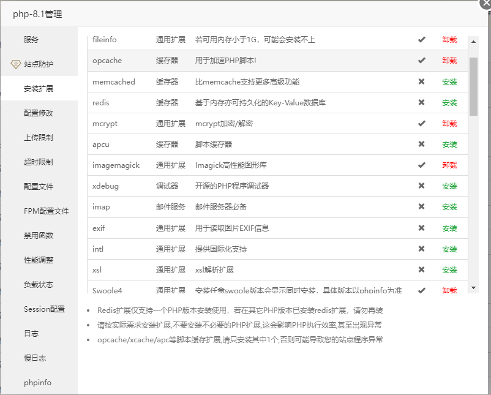

# Laravel8-basic-template

## 授权篇

项目内置了两种授权方案

```php
// 第一种: auth()
// 调用内置的 default guard 获取的是前台用户使用端的 auth

// 第二种: admin()
// 效果等同于`auth('admin')` 获取的是后台用户的 auth
// 这种方式的表和模型并没有创建,预留了位置供修改
// 语法糖配置:`app/helpers.php`  guard:`config/auth.php`
```

配置自动加载

```json
{
    "autoload": {
        "psr-4": {
            "App\\": "app/",
            "Database\\Factories\\": "database/factories/",
            "Database\\Seeders\\": "database/seeders/"
        },
        "files": [
            "app/helpers.php"
        ]
    }
}
```

使其生效

```bash
composer dump-autoload
```

## 运行环境

由于使用了`laravel-s`扩展,需要安装较多的扩展

- fileinfo
- opcache
- mcrypt
- imagemagick
- swoole4

### 宝塔



## 运行

```bash
php bin/laravels start

```
